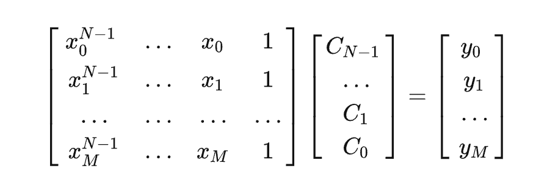

# Python 曲线的拟合

```python
import numpy as np
import matplotlib as mpl
import matplotlib.pyplot as plt
```

## 多项式拟合

```python
# 导入线性拟合工具
from numpy import polyfit,ploy1d

# 产生数据
x = np.linspace(-5,5,100)
y = 4*x+1.5
noise_y = y + np.random.randn(y.shape[-1]) * 2.5
```

```python
%matplotlib inline

p = plt.plot(x, noise_y, 'rx')
p = plt.plot(x, y, 'b:')
```

进行线性拟合，`polyfit` 是多项式拟合函数，线性拟合即一阶多项式：

```python
coeff = ployfit(x,noise_y,1)
print(coeff)
# [ 3.93921315  1.59379469]
```

一阶多项式 y=a1x+a0 拟合，返回两个系数 [a1,a0]。

画出拟合曲线：

```python
p = plt.plot(x, noise_y, 'rx')
p = plt.plot(x, coeff[0] * x + coeff[1], 'k-')
p = plt.plot(x, y, 'b--')
```

还可以用 `poly1d` 生成一个以传入的 `coeff` 为参数的多项式函数：

```python
f = poly1d(coeff)
p = plt.plot(x, noise_y, 'rx')
p = plt.plot(x, f(x))
```

```python
# 显示 f
f
# poly1d([ 3.93921315,  1.59379469])

print(f)
# 3.939 x + 1.594

# 还可以对它进行数学操作生成新的多项式
print(f + 2 * f ** 2)
```


## 多项式拟合正弦函数

```python
x = np.linspace(-np.pi,np.pi,100)
y = np.sin(x)
```

用一阶到九阶多项式拟合，类似泰勒展开：

```python
y1 = poly1d(polyfit(x,y,1))
y3 = poly1d(polyfit(x,y,3))
y5 = poly1d(polyfit(x,y,5))
y7 = poly1d(polyfit(x,y,7))
y9 = poly1d(polyfit(x,y,9))

x = np.linspace(-3 * np.pi,3 * np.pi,100)

p = plt.plot(x, np.sin(x), 'k')
p = plt.plot(x, y1(x))
p = plt.plot(x, y3(x))
p = plt.plot(x, y5(x))
p = plt.plot(x, y7(x))
p = plt.plot(x, y9(x))

a = plt.axis([-3 * np.pi, 3 * np.pi, -1.25, 1.25])
```


黑色为原始的图形，可以看到，随着多项式拟合的阶数的增加，曲线与拟合数据的吻合程度在逐渐增大。


## 最小二乘法拟合

```python
from scipy.linalg import lstsq
from scipy.stats import linregress
```

```python
x = np.linspace(0,5,100)
y = 0.5 * x + np.random.randn(x.shape[-1]) * 0.35
plt.plot(x,y,'x')
```


一般来书，当我们使用一个 N-1 阶的多项式拟合这 M 个点时，有这样的关系存在：



### scipy.linalg.lstsq 最小二乘解

要得到 `C` ，可以使用 `scipy.linalg.lstsq` 求最小二乘解。

这里，我们使用 1 阶多项式即 `N = 2`，先将 `x` 扩展成 `X`：

```python
X = np.hstack((x[:,np.newaxis],np.ones((x.shape[-1],1))))
```

```python
array([[ 0.05050505,  1.        ],
       [ 0.1010101 ,  1.        ],
       [ 0.15151515,  1.        ],
       [ 0.2020202 ,  1.        ]])
```

```python
# 求解
C, resid, rank, s = lstsq(X, y)
C, resid, rank, s
```

```
# output
(array([ 0.50432002,  0.0415695 ]),
 12.182942535066523,
 2,
 array([ 30.23732043,   4.82146667]))
```

